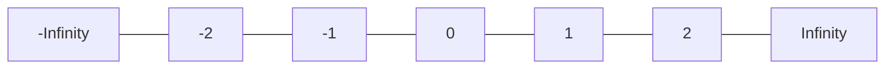

# 📘 Notes

## Why -1 is not a good starting value for finding the largest number

If you initialize the largest value as -1, it can give incorrect results when all numbers in the array are less than -1.



```js
[-5, -10, -3];
```

Here, the correct largest number is -3, but since -1 is already greater than all elements, your algorithm will incorrectly return -1.

👉 That’s why -1 is not a safe starting value.

✅ **Correct Approach**

Initialize the largest value with negative infinity (-Infinity):

- -Infinity is smaller than every possible number
- So any number in the array will always be greater than it

## Get the last digit from number

```js
let num = 439;
let lastDigit = 439 % 10; // 9
```

## Remove the last digit from number

Divide digit by 10 and truncate it

```js
let num = 1234;
num = Math.trunc(num / 10); // 123

👉 Math.trunc drop the fractional part
```

## Appending a digit to a number

```js
let n = 10;
let d = 5;

n = n * 10 + d; // 105
```
